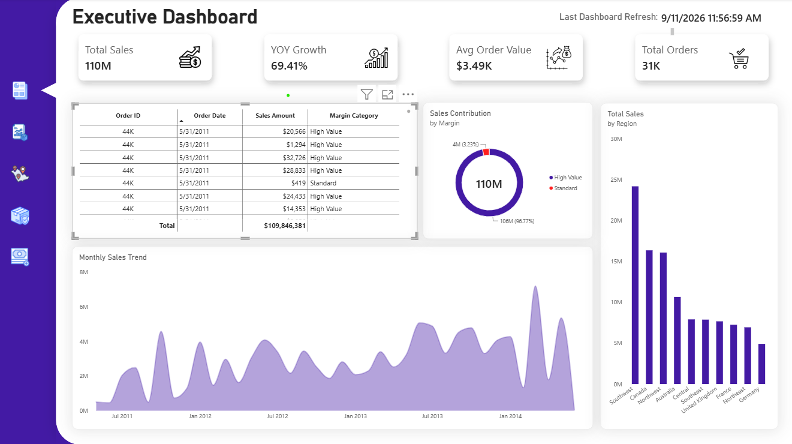
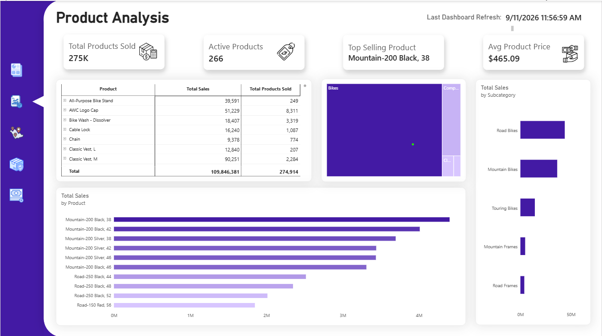
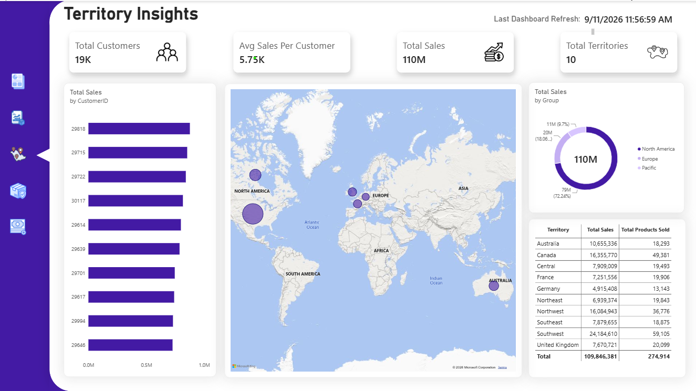
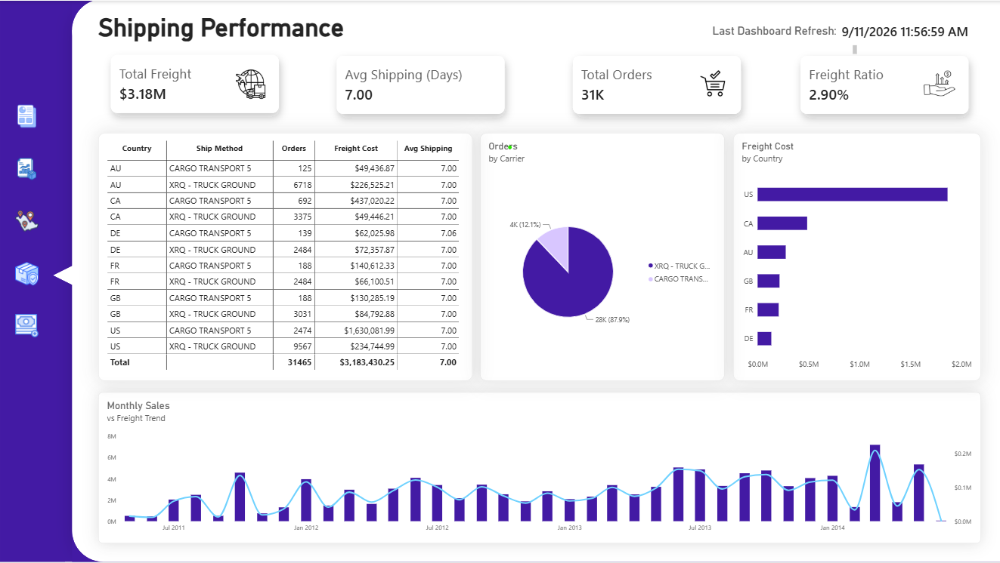
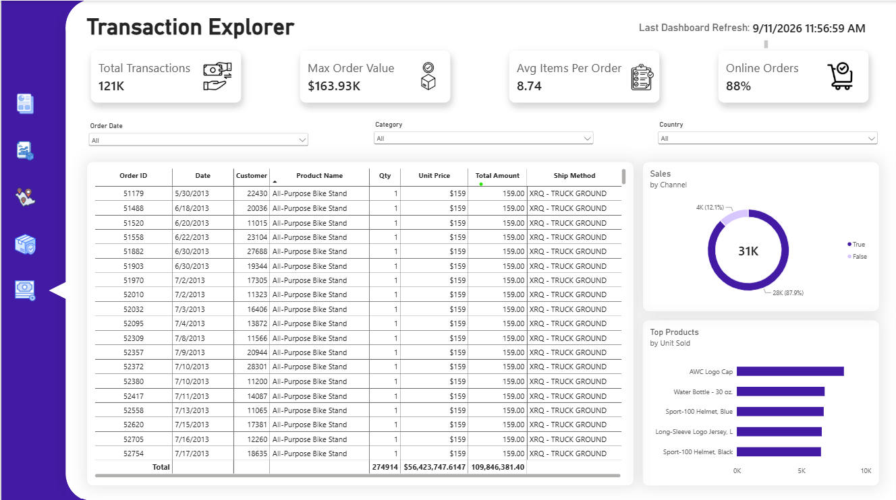
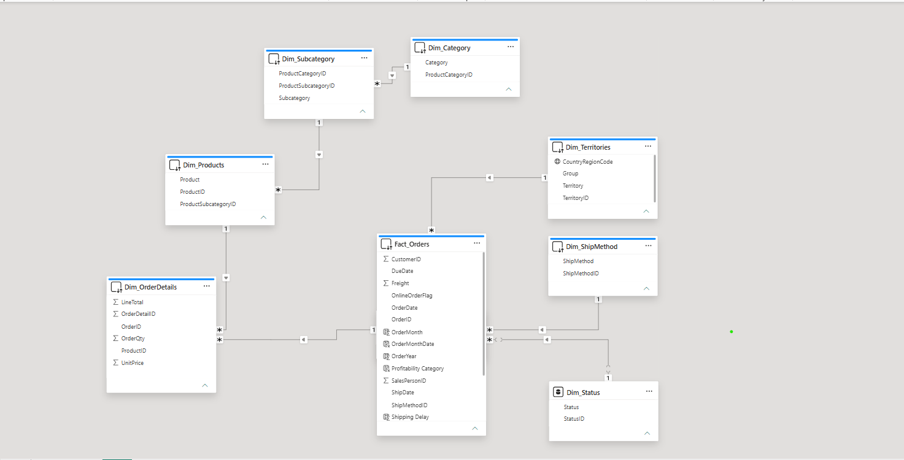

# 🚴 AdventureWorks Enterprise Business Intelligence & Operations Dashboard

---

## 📌 Executive Summary & Project Overview
This project delivers a multi-perspective, end-to-end Enterprise Business Intelligence solution developed in **Power BI Desktop** analyzing the **AdventureWorks** relational data model. The dashboard synthesizes **$110 Million in gross sales** across **31K orders** and **121K transaction line items**, delivering strategic visibility into executive financial KPIs, product line profitability, global territorial demand, logistics carrier performance, and granular transaction auditing.
---

## 🎯 Global Key Performance Indicators (KPIs)
* **Total Gross Revenue:** $110 Million ($109,846,381)
* **Year-over-Year (YOY) Revenue Growth:** +69.41%
* **Total Completed Orders:** 31K Orders (31,465)
* **Total Transaction Records Analyzed:** 121K Lines
* **Average Order Value (AOV):** $3.49K
* **Online vs. Offline Orders:** 88% Online Direct (28K orders) vs. 12% Wholesale/Reseller (4K orders)
* **Total Freight Costs:** $3.18 Million (representing a lean 2.90% Freight-to-Revenue Ratio)
* **Average Shipping Fulfillment:** 7.00 Days
---

## 🔍 In-Depth Analytical Breakdown

### 1. Executive Performance & Financial Trajectory
* **High-Margin Dominance:** **96.77% ($106M)** of total revenue stems from High-Value transactions, maintaining premium brand equity.
* **Geographic Revenue Hubs:** **Southwest ($24M)**, **Canada ($16M)**, and **Northwest ($16M)** generate over 50% of aggregate global turnover.
* **Growth Spikes:** Strong revenue acceleration began in mid-2013, achieving all-time peaks exceeding **$7M/month** leading into 2014.

### 2. Product Line Profitability & Category Mix

* **Active Catalog:** 266 active products generating **275K units sold** at an Average Unit Price of **$465.09**.
* **Flagship Revenue Drivers:** Mountain bikes drive top-line volume, led by **Mountain-200 Black, 38** (~$4.5M) and **Mountain-200 Black, 42** (~$4.0M).
* **Category Volume:** **Road Bikes** and **Mountain Bikes** dominate subcategory turnover, while accessories (like AWC Logo Cap at 8,311 units) lead unit volume.

### 3. Territory & Customer Distribution

* **Customer Base:** 19K global customers averaging **$5.75K in Lifetime Sales Value**.
* **Global Market Share:** **North America** represents **72.24% ($79M)** of sales, followed by **Europe at 18.06% ($20M)** and **Pacific at 9.7% ($11M)**.
* **Top Operating Markets:** Southwest ($24.18M | 59.1K products), Canada ($16.35M | 49.3K products), and Northwest ($16.08M | 36.7K products).

### 4. Supply Chain & Logistics Performance

* **Logistics Stability:** Average shipping transit time across all major destinations (AU, CA, DE, FR, GB, US) is rock-solid at **7.00 days**.
* **Carrier Utilization:** **XRQ - TRUCK GROUND** serves as the primary distribution channel (87.9% of orders | 28K orders), while **CARGO TRANSPORT 5** handles bulk fulfillment (12.1% | 4K orders).
* **Regional Freight Burden:** The **United States** accounts for the largest freight expenditure (~$1.86M across carriers).

### 5. Granular Transaction Explorer

* Auditing interface tracking **121K individual line items** with multi-parameter filtering across Order Date, Category, and Country.
* **Max Single Order Value:** Reached **$163.93K** with an average basket density of **8.74 items per order**.

  ---

## 🧩 Data Architecture & Relational Modeling
The project models an enterprise multi-fact relational schema connected via single and bi-directional 1-to-many relationships:

* **Central Fact Table:**
  * `Fact_Orders` (Order Date, Ship Date, Due Date, Freight, Profitability Category, Order Keys)
* **Line Item Fact / Extended Bridge:**
  * `Dim_OrderDetails` (LineTotal, OrderQty, UnitPrice, ProductID, OrderID)
* **Dimension Hierarchy:**
  * **Product Hierarchy (Snowflake):** `Dim_Products` ➔ `Dim_Subcategory` ➔ `Dim_Category`
  * **Geographical Dimension:** `Dim_Territories` (CountryRegionCode, Group, Territory)
  * **Operations & Fulfillment:** `Dim_ShipMethod` & `Dim_Status`
    ---

## 📐 Key DAX Measures

Total Sales = SUM(Fact_Orders[Sales Amount])

Freight Ratio % = 
DIVIDE(
    SUM(Fact_Orders[Freight]), 
    [Total Sales], 
    0
)

Avg Order Value = 
DIVIDE(
    [Total Sales], 
    DISTINCTCOUNT(Fact_Orders[OrderID]), 
    0
)

Online Order % = 
DIVIDE(
    CALCULATE(COUNTROWS(Fact_Orders), Fact_Orders[OnlineOrderFlag] = TRUE()),
    COUNTROWS(Fact_Orders),
    0
)

---

## 💡 Strategic Business Recommendations
1. **Capitalize on Direct-to-Consumer (D2C):** With 88% of orders coming online, digital personalization and checkout optimizations will have a direct multiplier effect on bottom-line margins.
2. **Standardize European Fulfillment:** While fulfillment speed is uniform (7 days), European markets (Germany, France, UK) show significantly lower AOV than North America; targeted category bundling is recommended.
3. **Logistics Cost Renegotiation:** Since XRQ Truck Ground commands 87.9% of total shipping volume, consolidating contracts can optimize the current $3.18M freight expenditure.

---

## 📥 How to Run Locally
1. Clone or download this repository.
2. Ensure you have **Power BI Desktop** installed.
3. Open the [AdventureWorks_Analytics.pbix](AdventureWorks_Analytics.pbix) file from the repository files list above to explore the interactive dashboard and navigation menus.
